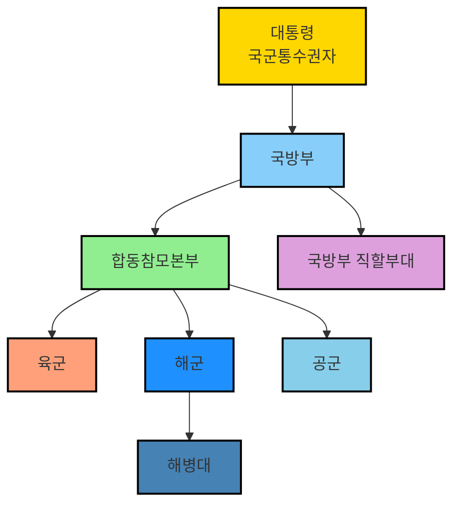

아키텍처를 텍스트로 그려줍니다.
https://excalidraw.com
mermaid.js 라는 것을 통해서 가능합니다.

엑스칼리버 라는 아더왕의 칼 이름과 비슷합니다.
excali 
그리기 draw 라는 합성어입니다.

상단 메뉴 오른쪽의 AI가 보이죠.
오늘 공유할 것은 저기입니다.

하루에 10번까지는 무료로 이용가능합니다.
10 requests left today

mermaid.js 의 핵심은 라이브러리가 텍스트를 다이어그램으로 표시한다는 것입니다.
그래서 AI에서 쉽게 그래픽으로 표시가 가능하게 된 기술입니다.



옵시디언에서도 
```
flowchart TD
    A[대통령\n국군통수권자] --> B[국방부]
    B --> C[합동참모본부]
    C --> D[육군]
    C --> E[해군]
    C --> F[공군]
    E --> G[해병대]
    B --> H[국방부 직할부대]
    
    style A fill:#FFD700,stroke:#000,stroke-width:2px
    style B fill:#87CEFA,stroke:#000,stroke-width:2px
    style C fill:#90EE90,stroke:#000,stroke-width:2px
    style D fill:#FFA07A,stroke:#000,stroke-width:2px
    style E fill:#1E90FF,stroke:#000,stroke-width:2px
    style F fill:#87CEEB,stroke:#000,stroke-width:2px
    style G fill:#4682B4,stroke:#000,stroke-width:2px
    style H fill:#DDA0DD,stroke:#000,stroke-width:2px
```

\`\`\`mermaid
라고 시작하면 그래픽으로 표시됩니다.

`Spring Boot와 React 그리고 MariaDB의 관계도를 그려줘` 라고 해보겠습니다.

TD는 Top Down 의미입니다.
LR로 수정하면 좌우로 표시됩니다.

오늘은 여기까지입니다.
https://mp4.okdevtv.com 에서 새로 올라오는 기술 영상들을 확인해 보세요.
