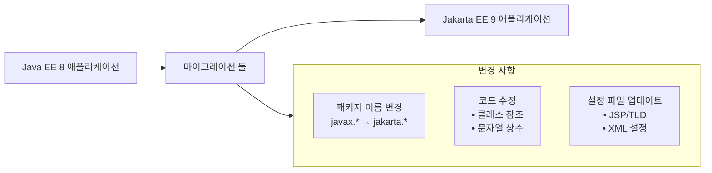

## Java EE에서 Jakarta EE로! 대규모 마이그레이션
- https://github.com/apache/tomcat-jakartaee-migration
아파치 톰캣의 Jakarta EE 마이그레이션 툴은 Java EE 8 기반의 웹 애플리케이션을 Jakarta EE 9로 자동 변환해주는 도구입니다. 
Command Line 또는 Ant 태스크로 사용할 수 있으며, 패키지 이름 변경부터 XML 설정 파일까지 자동으로 변환합니다.



###  다운로드 및 설치

- 공식 웹사이트에서 바이너리 배포본 다운로드 가능
- 소스 코드를 직접 빌드하려면 다음 명령어 사용:
```bash
./mvnw verify
```


- 실행 가능한 JAR 파일은 `target/jakartaee-migration-*-shaded.jar`에서 찾을 수 있습니다

###  사용 방법

1. **실행**:
```bash
java -version #17
java -jar jakartaee-migration-*-shaded.jar <소스> <대상>

java -jar jakartaee-migration-1.0.10-SNAPSHOT-shaded.jar 9 9_
```

  - 소스는 압축 파일, 폴더 또는 개별 파일 경로를 지정
  - 대상은 소스와 동일한 형식으로 생성


2. **Ant 태스크로 사용**:
```xml
<taskdef name="javax2jakarta" classname="org.apache.tomcat.jakartaee.MigrationTask" classpath="jakartaee-migration-*-shaded.jar"/>

<javax2jakarta src="webapp.war" dest="webapp.migrated.war" profile="tomcat"/>
```

### 주요 기능

- 패키지 이름 자동 변경 (`javax.*` → `jakarta.*`)
- 코드 내 모든 참조 수정
- 설정 파일 자동 업데이트
- JSP 및 TLD 파일 처리
- XML 스키마 유지 (변경 불필요)

### 주의사항

- JAR 파일 내 서명(signature)가 제거될 수 있음
- 변경된 각 JAR 파일마다 경고 로그가 기록됨
- Debian, Ubuntu, Fedora 시스템에서는 `tomcat-jakartaee-migration` 패키지를 설치하여 `javax2jakarta` 명령어로 사용 가능

![[tomcat9to10-01.png]]
![[tomcat9to10-02-webxml.png]]

![[tomcat9to10-03-utf.png]]

![[tomcat9to10-04-utf8.png]]